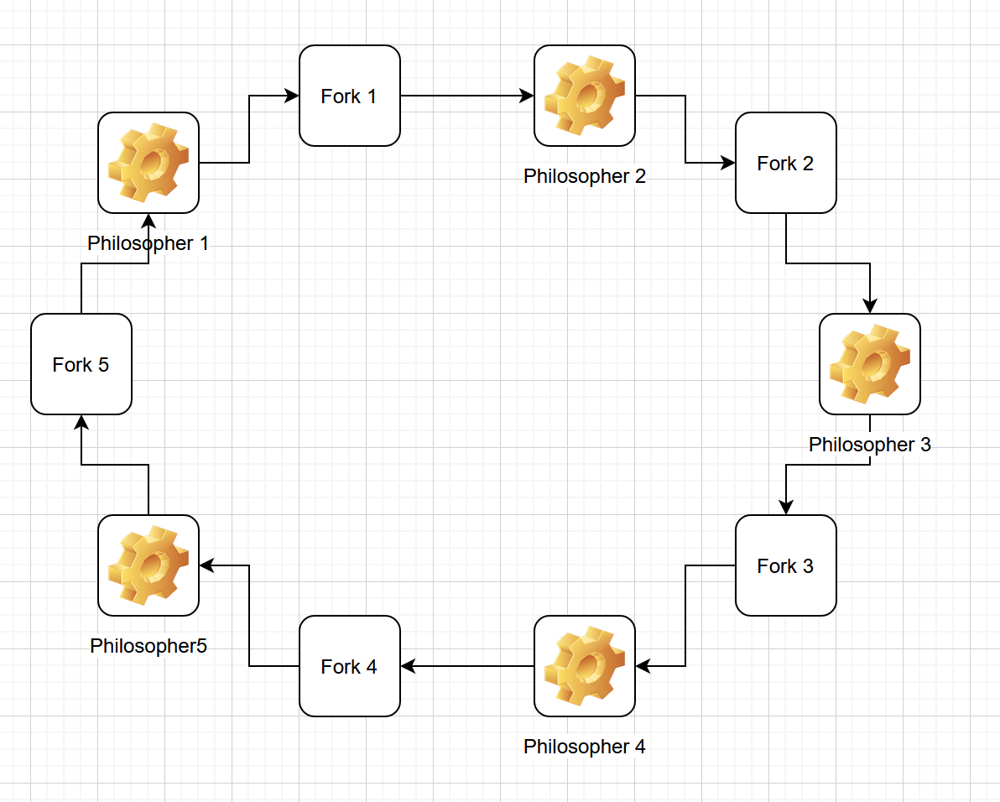

# Task 2a
## Equipment Graph

Since each Philosopher takes the fork to his left and then waits for the fork to his right, each philosopher is locked out and waiting for a fork to be released, which ultimatively depends on him holding his fork.

# Task 2c
Instead of acquiring the forks from left to right, we can acquire them according to their number. Always acquiring the lower number fork first. This modification ensures that there is no circular wait and avoids the possibility of deadlock.